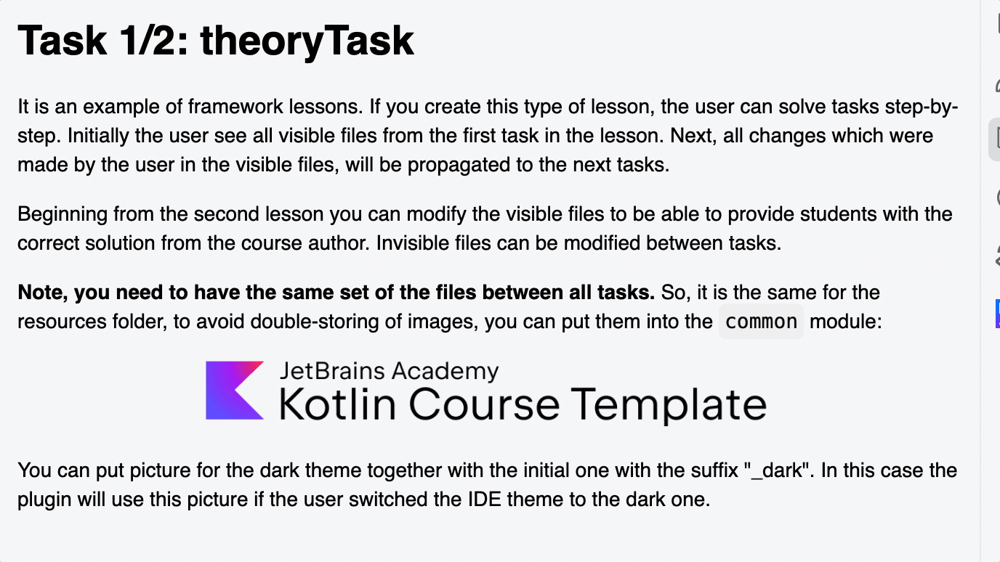

This is an example of a framework lesson. 
In this type of lesson, students build their solutions step by step.
Initially, the user sees all the visible files from the first task.
From there, any changes the student makes to visible files 
will propagate to subsequent tasks.

Starting from the second task, you can modify the visible files to provide 
students with the author's reference solution. 
Invisible files can also be modified between tasks.

**Note: You must maintain the exact same file structure across all tasks in a framework lesson.** 
This rule also applies to the `resources` folder. To avoid duplicating images across tasks, 
store shared assets in the `common` module:

    

You can provide a dark-theme variant of an image by adding the "_dark" suffix to its filename (placed alongside the original image). 
The plugin will automatically use this image whenever the user switches to a dark IDE theme:

    

