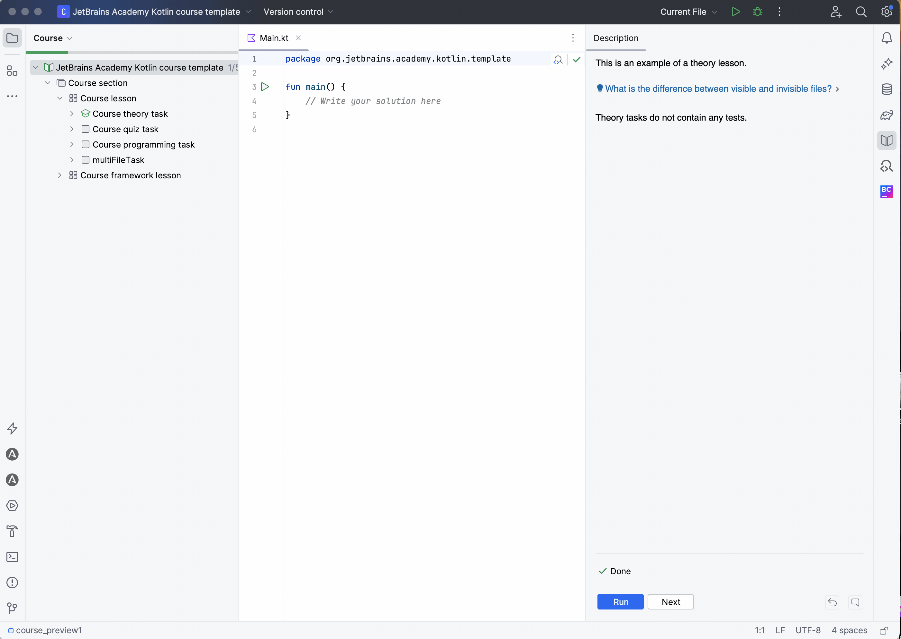

This is an example of an input/output task. 
In this task type, you can specify the expected input and output for the program instead of writing 
custom tests.

This task also demonstrates how to control which file opens by default in student mode when a task contains multiple files.
Simply place the desired file first in the task's `task-info.yaml` configuration file. For example, in this task, `MainTaskFile.kt` opens first: 

